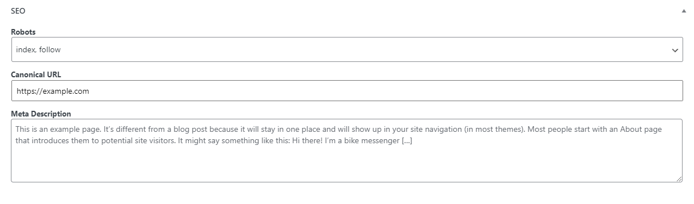

# Just SEO

Are you sick of the big SEO plugins, with all of their bloat and unnecessary bells and whistles? Then Just SEO might just be for you!

As the name suggests it includes just the essentials for optimising SEO on your site. The features include:

1. Robots meta value. So you can set index / oindex on specific posts and pages.
2. Set the meta description for posts and pages
3. Set the canonical URL for posts and pages.
4. Provide a basic, short sitemap for posts on the site. (yoursite.com/sitemap.xml)

That is all you really need and that is what you get. Simple, clean, intuitive.
